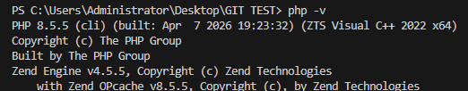
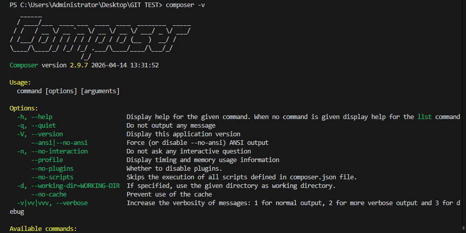
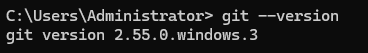
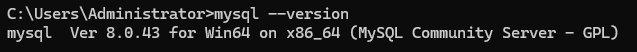
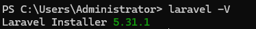
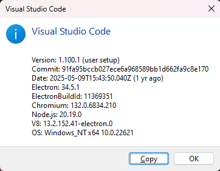
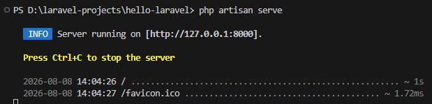
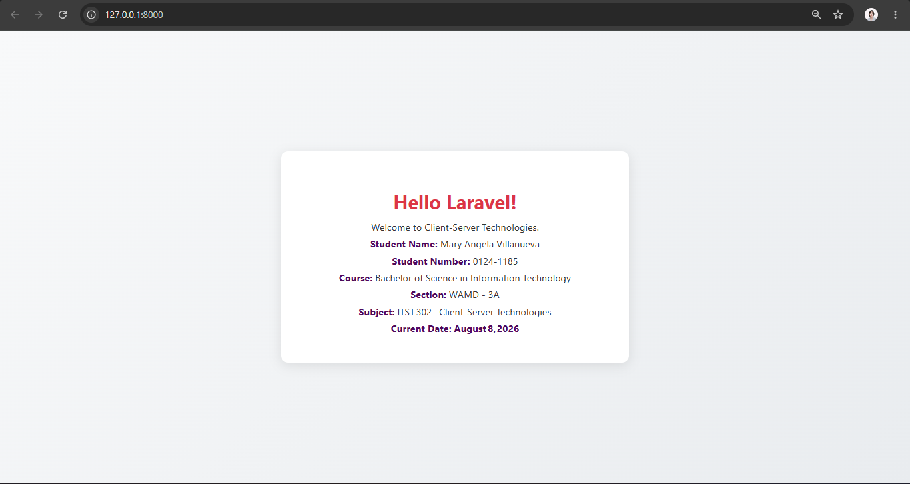

# ITST 302 — Client-Server Technologies

## 1. Project Title
Laravel Development Environment Setup 

---

## 2. Introduction

**Brief overview of Laravel**
Laravel is a PHP framework that helps developers build web applications in a structured and organized way. It comes with many built‑in tools such as routing, database handling, application configuration, and view management. These tools save developers time because they do not need to create everything from scratch. 

**Importance of Client-Server Technologies**
Client‑Server Technologies are important because they explain how the client side and the server side work together in an application. The client is the part that users see and interact with, such as a web page or mobile app. The server is the part that processes requests, runs the logic, manages the database, and sends back the correct response. Without it, applications would not be able to handle data properly or provide the right information to users.

**Purpose of the Project** 
The main goal/purpose of the Project was to set up the necessary development tools and create a Laravel project. It included installing and configuring the required software, checking if the development environment was working properly, setting up the Laravel application, running the development server, and making changes to the default Laravel homepage.

---

## Objectives
- Install and configure PHP.    
- Install and verify Laravel framework.  
- Install and configure Git.    
- Create a Laravel project using Composer.   
- Track project history using Git.

---

## Development Environment
- **OS:** Windows  
- **PHP:** 8.5.5 
- **Laravel:** 13.24.0  
- **Composer:** 2.9.7 
- **Git:** 2.55.0  
- **MySQL:** 8.0.43  
- **VS Code:** 1.100.1 

---

## Installation Steps
1. Verify PHP installation → `php -v`  
   

2. Verify Composer installation → `composer --version`  
   

3. Verify Git installation → `git --version`  
   

4. Verify MySQL installation → `mysql --version`  
   

5. Verify Laravel installation → `php artisan --version`  
   

6. Verify VS Code installation  
   

7. Create Laravel project → `composer create-project laravel/laravel hello-laravel`

8. Configure Laravel application → `php artisan key:generate`

9. Configure database → create `database/database.sqlite` and run `php artisan migrate`

10. Run Laravel server → `php artisan serve`  
    

11. Customize homepage → edit `resources/views/welcome.blade.php`  
    

---

## Project Structure
Laravel has different folders, and each folder has its own purpose. The important folders used in this project are:

**app/**
Contains the main code of the Laravel application. This is where files such as controllers, models, and other application logic are stored.

**routes/**
Contains the routes of the application. Routes tell Laravel what to do when a user visits a specific URL.

**resources/**
Contains the files used for the application's pages and design. This includes views, CSS, and JavaScript files.

**public/**
Contains files that can be accessed directly by the browser. It also contains the main index.php file that starts the Laravel application.

**config/**
Contains the settings and configuration files of the Laravel application. These files control different parts of how the application works.

**database/**
Contains files related to the database. This folder includes migrations, seeders, and factories used to create and manage database data.

---

## Problems Encountered
- MySQL command not recognized.  
- Missing PHP fileinfo extension.  
- SQLite PDO driver missing.  

---

## Solutions
- Located MySQL executable and fixed PATH.  
- Enabled PHP fileinfo extension in `php.ini`.  
- Enabled SQLite extensions (`pdo_sqlite`, `sqlite3`).  

---

## 9. Screenshots

Below are the screenshots that show the setup and results of the Laravel development environment.

### Screenshot 1 — PHP Version
This screenshot shows the PHP version installed and verified through the command line.  

### Screenshot 2 — Composer Version
This screenshot shows the Composer version used for PHP dependency management.  

### Screenshot 3 — Git Version
This screenshot shows the Git version installed for version control.  

### Screenshot 4 — MySQL Version
This screenshot confirms that MySQL Community Server 8.0.43 was installed successfully.  

### Screenshot 5 — Laravel Version
This screenshot shows the Laravel Framework version used by the project.  

### Screenshot 6 — Visual Studio Code
This screenshot shows the Visual Studio Code environment used for development.  

### Screenshot 7 — Laravel Development Server
This screenshot shows the Laravel development server running through `php artisan serve`.  

### Screenshot 8 — Customized Laravel Homepage
This screenshot shows the customized homepage created for the Client‑Server Technologies activity.  

---

## Reflection
This laboratory activity helped me learn the basic steps in setting up and using Laravel for web development. Before doing this activity, I only had a simple idea of what Laravel was. I did try to use it before but I really find it tough to use. That is why I switched back to pure PHP. After completing the different tasks, I learned how Laravel works as a PHP framework and how it can help developers create web applications in a more organized way. I learned how to install the needed software, set up Composer, create a Laravel project, check if the development environment is working, and run the Laravel development server. I also learned about the important folders in a Laravel project and their purposes.
During the activity, I encountered several challenges while setting up the development environment. One of the problems I experienced was that the MySQL command was not recognized. This meant that I could not use the MySQL command in the Command Prompt because it was not properly recognized by the system. I also encountered an error because the PHP fileinfo extension was missing. Since Laravel requires some PHP extensions to work properly, I had to check the PHP settings and make sure the needed extension was enabled. Another challenge was the missing SQLite PDO driver, which also caused problems when trying to use the database. These errors were confusing at first, but they helped me understand that proper software configuration is very important when developing applications.
I also learned why Laravel is important in client-server development. Laravel provides tools and a clear structure that make it easier to build web applications. It helps manage routes, requests, databases, and other parts of a web application. Because of this, developers can create applications in a more organized and efficient way. 
To conclude my reflection, this laboratory activity gave me useful knowledge and experience that I can use in future software development projects. I learned not only how to create a Laravel application, but also how to solve basic technical problems, document my work, use GitHub, and share my progress professionally. These skills will help me to become more prepared when working on larger web development projects in the future.

---

## References
- Laravel Documentation. https://laravel.com/docs/13.x  
- Composer Documentation. https://getcomposer.org/doc/  
- Git Documentation. https://git-scm.com/docs/git  
- PHP Documentation. https://www.php.net/manual/en/  
- Visual Studio Code Documentation. https://code.visualstudio.com/docs/getstarted/overview  
